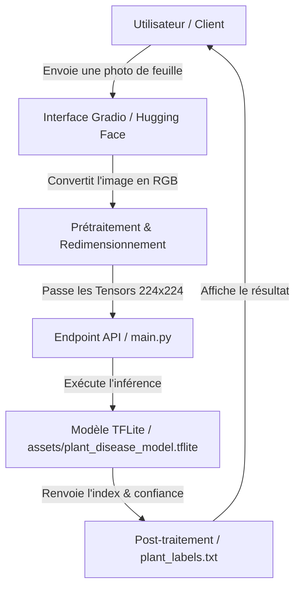

# 🌱 Plant Detector

Projet d'Intelligence Artificielle dédié à la détection et au diagnostic automatique des maladies des plantes à partir d'images.

---

## 🔗 1. Déploiement Final
👉 **[Accéder au Space Hugging Face](https://huggingface.co/spaces/Melizara/plant-detector)**

---

## 📐 2. Capture du Pipeline & Architecture Complexe

## 🛠️ 3. Structure du Projet
📁 Données & Modèle (assets/)
plant_disease_model.tflite : Modèle IA optimisé TFLite pour la classification des pathologies (entrée 224x224 RGB).

plant_labels.txt : Mapping des index de sortie vers les noms des maladies.

🐍 Scripts & Configuration
main.py : API FastAPI exposant l'endpoint /predict (POST) pour exécuter l'inférence via tf.lite.Interpreter.

app.py : Interface Gradio déployée sur Hugging Face pour téléverser une photo et afficher le diagnostic.

requirements.txt : Dépendances (fastapi, uvicorn, tensorflow, pillow, numpy, gradio).
